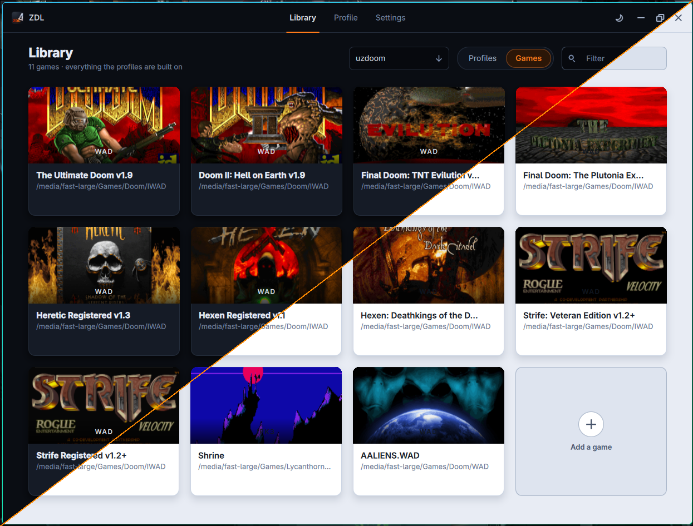

# ZDL

A launcher for Doom engine source ports. Pick a port, pick a game, add whatever you want on top of it, and launch.

## Install

Download the build for your system from the
[releases page](https://github.com/spacebub/qzdl/releases).

ZDL is only the launcher. The source port and the game data (IWADs/IPK3s) are yours to get separately.

## Quick start

1. Open **Engines** and add the source ports you already have, or let ZDL fetch
   one for you under **Get more**. Games are added on the library's games shelf.
   Each one is named after the file it points at.
2. Back on the library, press **New profile**, or click a game to play it as it
   is.
3. Pick a source port and a game, add any PWADs or patches under **Add-ons**,
   then press **Launch**.

Add-ons reach the source port in the order they are listed, and each one can be
switched off without being removed.

## Engines

**Engines** is where the source ports live. **Installed** holds the ones this
config knows about, one card each, with the card at the end for adding a port
that is already on the machine. A port can be renamed, pointed at another file,
opened in a file manager or taken out again from its own card.

**Get more** is the list ZDL knows where to fetch: UZDoom, GZDoom, ZDoom,
Zandronum, DSDA-Doom, Woof!, Nugget Doom, Chocolate Doom and Crispy Doom, plus
MBF and Doom Legacy, which are DOS programs and say so on the card. Press
**Install** and the build for this system is downloaded, unpacked into ZDL's
own data directory and added to the installed ones, ready to be picked on a
profile. A DOS one is added as a DOS program, so it is launched inside DOSBox.

What each project has released is looked up on GitHub when the page is opened.
Nothing else is sent anywhere and nothing is downloaded until it is asked for.
A port with no build for the system in use says so and links to its own page
instead, as do the few that are not released on GitHub at all.

**Update** takes the place of the install button once a project has released
something newer than what was fetched, and keeps every profile pointed at it.
Removing a fetched port deletes what was unpacked with it.

What a port was fetched from is kept, so fetching the same build again unpacks
what is already here instead of downloading it twice. Settings says how much is
being kept and empties it.

## Profiles

A profile is a saved set of launch options: port, game, add-ons, map, skill,
multiplayer and the rest. Nothing ties it to a particular game, so it can be a
game, a single mod, a multiplayer setup or anything else worth coming back to.
The heading at the top of the page is how you switch between them.

## Per profile port settings

Everything above is what ZDL hands the source port. The port's own settings,
controls, video and sound, normally live in one file it shares between every
launch.

Turn on **A config file per profile** in Settings and each profile is given a
config file of its own instead. One profile can opt back out with **Use the
port's own settings** on its page.

## Per profile port settings

A profile tries to set a port's saves directory to its own configuration dir
in  the current OS' data dir. See [Where things are kept](#Where-things-are-kept).

## Writing the command yourself

Everything on a profile page works out a command line for the source port. For
the launches nothing here was built to describe, turn on **Write the command
myself** under Command line and type the whole thing instead.

What the rest of the page knows can still be reached, so the paths need not be
typed out or kept up to date by hand:

| Word            | Stands for                                            |
|-----------------|-------------------------------------------------------|
| `{source_port}` | the source port this profile is set to                |
| `{game}`        | the game this profile is set to                       |
| `{addon_n}`     | an add-on from the list; `{addon_1} .. {addon_n}`     |
| `{profile}`     | the profile's own folder, where the two below live    |
| `{cfgdir}`      | the port config written for this profile              |
| `{savedir}`     | the profile's saves folder `{profile}/saves`          |

A word that stands for something the profile does not have (`{addon_3}` on a
profile with two) is said under the field, and the profile does not launch
until it is fixed. Everything else is passed on as typed, so a launch can be
wrapped in anything the system has: `gamemoderun {source_port} -iwad {game}`.

The command starts as the one ZDL would have run, written in these words, so
it is a line to edit rather than a blank one.

## DOS ports

A source port can be marked as a DOS program when it is added or edited, and is
then launched inside DOSBox. The DOS ones ZDL fetches are marked already. Point
Settings at a DOSBox, or leave it empty and whichever one the machine already
has is used. A profile on a DOS port gives DOSBox the whole screen unless
**Full screen** is turned off on its page.

The oldest ports never heard of `-iwad` and look for the game where they are
run from. Those are handed `$DOOMWADDIR` instead, inside the box as well as
outside it, so the game is still found.

## Where things are kept

|                          | Linux                                | Windows                         |
|--------------------------|--------------------------------------|---------------------------------|
| Settings (`zdl.json`)    | `~/.config/qzdl`                     | `%APPDATA%\qZDL`                |
| Per profile port configs | `~/.local/share/qzdl/profiles`       | `%APPDATA%\qZDL\profiles`       |
| Fetched source ports     | `~/.local/share/qzdl/source_ports`   | `%APPDATA%\qZDL\source_ports`   |
| What they were fetched from | `~/.local/share/qzdl/downloads`   | `%APPDATA%\qZDL\downloads`      |

A `zdl.json` next to the executable is used when there is no per user config,
which is what keeps a portable setup portable. A config from an older ZDL is
found in its old location and converted on first run.

Single launch configurations can also be exported to and imported from `.zdl`
files, which other Doom tools read too.

## Building

See [COMPILE.md](COMPILE.md).

## License

Copyright (c) 2023-2026 spacebub  
Copyright (c) 2018-2019 Lcferrum  
Copyright (c) 2004-2012 ZDL Software Foundation  

GNU General Public License, version 3 or later. See [LICENSE](LICENSE).

Uses the miniz and yyjson libraries. See [AUTHORS](AUTHORS).
